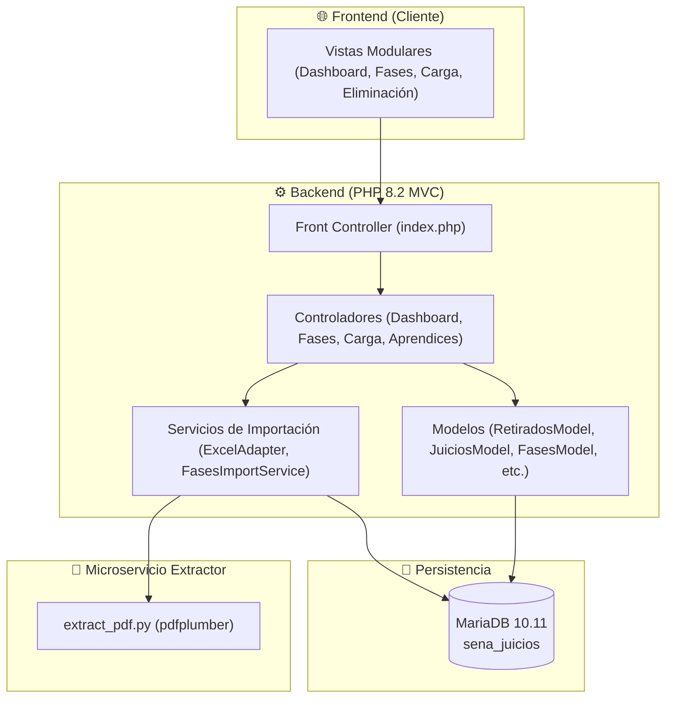

# 📊 Sistema de Gestión de Datos — SENA (v1.4.1)

[](https://www.php.net/)
[](https://mariadb.org/)
[](https://www.docker.com/)
[](LICENSE)

Bienvenido al **Sistema de Gestión de Datos**. Es una solución web integral diseñada para el análisis de juicios evaluativos de **Sofia Plus**, monitoreo de la curva de supervivencia estudiantil, seguimiento del avance formativo por proyectos curriculares (**PDF GFPI-F-016**) y auditoría de instructores en el marco del SENA.

Desarrollado en PHP nativo 8.2 bajo una arquitectura **MVC profesional**, con servicios de extracción automatizada en Python (`pdfplumber`), base de datos relacional y contenedorización completa con Docker y despliegue continuo vía `deploy.sh`.

---

## 📑 Tabla de Navegación Documental

| Documento | Descripción |
| :--- | :--- |
| 👤 [Manual de Usuario](docs/Manual_de_Usuario.md) | Guía práctica de uso del aplicativo para usuarios y coordinadores |
| 📜 [Registro de Cambios](CHANGELOG.md) | Historial detallado de versiones y mejoras (v1.0.0 a v1.3.0) |
| 📋 [Plan de Implementación](docs/PLAN_DE_IMPLEMENTACION.md) | Fases estratégicas, cronograma y objetivos de evolución |
| 📖 [Documentación Técnica](docs/documentacion-tecnica.md) | Componentes, esquema de base de datos relacional y endpoints |
| 🗄️ [Diccionario de Tablas](docs/DICCIONARIO_TABLAS.md) | Explicación exhaustiva de cada tabla, campos, propósitos y relaciones |
| 📋 [Especificación de Requisitos](docs/Especificacion_Requisitos.md) | Requisitos Funcionales (RF), No Funcionales (RNF) y alcance |
| 🚀 [Manual de Despliegue VPS](docs/DESPLIEGUE_VPS.md) | Guía de instalación y actualización en servidores VPS con Docker y Nginx |
| 🏗️ [Arquitectura y Seguridad](docs/ARQUITECTURA_Y_SEGURIDAD.md) | Diagramas MVC, flujo de datos Sofia Plus + PDF y seguridad HTTP |
| 🤝 [Guía para Colaboradores](docs/CONTRIBUTING.md) | Estándares de código, convenciones de Git y Pull Requests |
| ⚖️ [Licencia MIT](LICENSE) | Términos legales de propiedad intelectual y uso abierto |

---

## 🚀 Características Principales

### 📊 1. Dashboard y Curva de Supervivencia
* **Curva de Retiros Escalonada (`stepped: 'before'`):** Visualiza la retención de aprendices a lo largo de las competencias ordenadas cronológicamente.
* **Cálculo de Fechas Reales 2025:** Muestra el momento exacto de retiro o traslado del aprendiz según su último juicio aprobado en Sofia Plus.
* **Aislamiento de Docentes por Ficha:** Cada competencia muestra únicamente el instructor oficial evaluador registrado para ese programa.
* **Tabla de Retiros de 7 Columnas:** Cuadre perfecto entre programa, competencia, fase SENA, fecha de salida, cantidad, aprendices e instructores.

### 🗺️ 2. Fases Formativas e Integración Curricular (PDF GFPI-F-016)
* **Gestión de Proyectos Desacoplada (Modelo v4):** Los proyectos formativos se cargan y almacenan de forma independiente a las fichas. Un mismo proyecto curricular puede ser reutilizado y vinculado a múltiples fichas o cohortes.
* **Extracción Inteligente de PDF:** Parser en Python (`pdfplumber`) optimizado que procesa proyectos curriculares complejos, deduplica automáticamente resultados, maneja celdas combinadas y detecta las fases canónicas (`ANÁLISIS`, `PLANEACIÓN`, `EJECUCIÓN`, `EVALUACIÓN`).
* **Línea de Tiempo Dinámica y Cumplimiento:** Monitoreo del avance porcentual comparando los resultados requeridos por el diseño curricular vs los juicios evaluativos emitidos en Sofia Plus.
* **Cruce Automático de Malla:** Asociación jerárquica por código de resultado (`codigo_resultado`) y asignación secuencial a cada fase y actividad.

### 📥 3. Carga Masiva y Procesamiento por Lotes
* **Procesamiento de 500 Filas por Bloque:** Importa reportes `.xlsx`, `.xls` y `.csv` de gran tamaño sin exceder los límites de memoria del servidor.
* **Detección Automática de Columnas:** Mapeo inteligente de encabezados independientemente del orden o formato.
* **Trazabilidad y Fechas de Corte:** Extracción automática de la fecha del archivo, confirmación con selector de fecha y registro histórico en `historial_cortes_reportes` con zona horaria de Colombia.
* **Fusión Inteligente sin Retrocesos:** Los juicios aprobados ya existentes se protegen permanentemente, incorporando únicamente nuevos avances.

### 🔍 4. Filtro Avanzado, Auditoría y Gestión
* **Auditoría por Instructor:** Monitoreo del total de juicios registrados con fecha real del primer y último registro evaluado.
* **Búsqueda Multicriterio y Exportación CSV:** Consulta paginada en tiempo real con descarga en CSV estructurado con codificación UTF-8 BOM.
* **Búsqueda y Eliminación Controlada:** Búsqueda flexible por documento o nombre/apellido con confirmación modal.

---

## 🛠️ Stack Tecnológico

* **Backend:** PHP 8.2+ (Arquitectura MVC, Programación Orientada a Objetos, PDO Seguro con Sentencias Preparadas).
* **Base de Datos:** MariaDB 10.11 / MySQL (Integridad referencial en cascada, transacciones ACID).
* **Extractor de Proyectos:** Python 3.11 + `pdfplumber` (microservicio de parseo estructurado).
* **Frontend:** Vanilla CSS Modularizado + JavaScript Vanilla (sin dependencias pesadas).
* **Librería de Gráficos:** Chart.js 4.x.
* **Infraestructura:** Docker + Docker Compose + Nginx Reverse Proxy con SSL (Certbot).

---

## 🏗️ Arquitectura General



---

## ⚡ Instalación y Puesta en Marcha

### Opción A: Entorno Local con XAMPP
1. Clona el repositorio dentro de tu directorio `htdocs`:
   ```bash
   git clone https://github.com/Santiago072/sistema_gestion_datos.git
   ```
2. Importa el esquema de base de datos desde [`BD.txt`](BD.txt) en tu gestor MySQL (base de datos `sena_juicios`).
3. Configura tus credenciales en [`config/database.php`](config/database.php).
4. Abre tu navegador e ingresa a `http://localhost/sistema_gestion_datos`.

### Opción B: Despliegue en Producción (VPS Linux con Docker)
Ejecuta el script de despliegue automatizado:
```bash
bash deploy.sh
```
*Para consultar la guía completa paso a paso, visita el [Manual de Despliegue VPS](docs/DESPLIEGUE_VPS.md).*

---

## ⚖️ Licencia

Este proyecto está bajo la Licencia **MIT**. Consulta el archivo [LICENSE](LICENSE) para más detalles.
