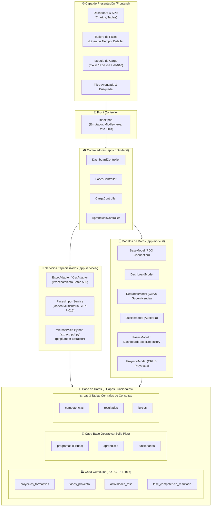
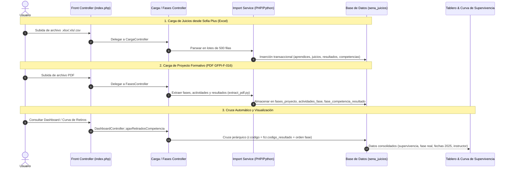

# 🏗️ Arquitectura y Seguridad del Sistema

Este documento describe detalladamente la arquitectura de software, los patrones de diseño, el flujo de datos del procesamiento dual (Excel + PDF) y las políticas de seguridad implementadas en el **Sistema de Gestión de Datos**.

---

## 🏛️ Patrón Arquitectónico: MVC Extendido

El sistema implementa una arquitectura **Modelo-Vista-Controlador (MVC)** con Front Controller centralizado y Servicios especializados para tareas de alto procesamiento:

---

## 📊 Arquitectura de Datos: División por Capas y las 3 Tablas de Consultas

La persistencia de datos está estructurada para optimizar tanto la integridad referencial como la velocidad de consulta analítica en dashboards de gran volumen:

1. **Capa Curricular (Estructura Pedagógica - PDF GFPI-F-016):**
   - Conformada por `proyectos_formativos`, `fases_proyecto`, `actividades_fase` y `fase_competencia_resultado`.
   - Modela la **teoría formativa**: qué fases existen, qué actividades se ejecutan y qué resultados deben alcanzarse.
2. **Capa Base Operativa (Entidades Maestras - Sofia Plus):**
   - Conformada por `programas` (fichas matriculadas), `aprendices` (estudiantes y sus estados) y `funcionarios` (instructores).
   - Es la base relacional sobre la cual se registran las matrículas y los responsables pedagógicos.
3. **Las 3 Tablas Centrales de Consultas Analíticas (`competencias`, `resultados`, `juicios`):**
   - Es el **motor analítico del sistema**, donde se registra el desempeño evaluativo real de cada aprendiz.
   - **`competencias`**: Agrupa y clasifica las normas cursadas por ficha y aprendiz.
   - **`resultados`**: Desglosa cada resultado individual con su código normalizado.
   - **`juicios`**: Almacena el estado evaluativo (`APROBADO`, `POR EVALUAR`), la fecha exacta y el instructor que emitió el juicio.
   - **Impacto en Consultas:** Los modelos `DashboardModel`, `RetiradosModel` y `JuiciosModel` ejecutan `JOINs` indexados sobre este trío para generar en milisegundos los KPIs globales, la Curva de Supervivencia 2025, la auditoría docente y el cruce con las fases curriculares.

---

## 🔄 Flujo de Datos del Procesamiento Dual

El sistema integra información proveniente de dos fuentes oficiales:

---

## 🛡️ Políticas y Medidas de Seguridad Implementadas

1. **Cabeceras de Seguridad HTTP:**
   - `X-Frame-Options: SAMEORIGIN` (Protección contra Clickjacking).
   - `X-Content-Type-Options: nosniff` (Prevención de MIME Confusion Attacks).
   - `X-XSS-Protection: 1; mode=block` (Mitigación de Cross-Site Scripting reflejado).
   - `Referrer-Policy: strict-origin-when-cross-origin`.

2. **Control de Frecuencia (Rate Limiting):**
   - Sistema de limitación de tasa por IP en endpoints AJAX (`verificar_rate_limit`) para mitigar ataques de denegación de servicio (DoS) o fuerza bruta.

3. **Prevención de Inyecciones SQL:**
   - 100% de las consultas a la base de datos se ejecutan a través de **PDO con Sentencias Preparadas** y parámetros tipados, desactivando emulaciones vulnerables (`PDO::ATTR_EMULATE_PREPARES => false`).

4. **Integridad Transaccional:**
   - La importación masiva de datos (Excel y PDF) se ejecuta bajo bloques `beginTransaction()`, `commit()` y `rollBack()`, garantizando que ningún error parcial deje la base de datos en estado inconsistente.

5. **Aislamiento en Docker:**
   - El contenedor de base de datos (`gestion_datos_db`) no expone puertos públicos a internet; la comunicación se realiza exclusivamente en la red bridge privada con el contenedor de la aplicación (`gestion_datos_app`).
