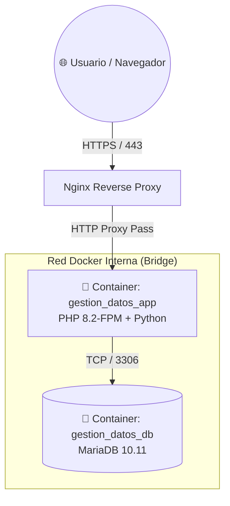

# 🚀 Guía de Despliegue en Servidor VPS Linux

Esta guía detalla el procedimiento para desplegar, configurar y actualizar el **Sistema de Gestión de Datos** en un servidor VPS con Linux (Ubuntu/Debian) utilizando Docker, Docker Compose y Nginx Reverse Proxy con SSL.

---

## 🛠️ Requisitos Previos del Servidor

* **Sistema Operativo:** Ubuntu 22.04 LTS / 24.04 LTS o Debian 12
* **Motor de Contenedores:** Docker Engine (24.x o superior) y Docker Compose v2
* **Reverse Proxy:** Nginx con Certbot (Let's Encrypt)
* **Control de Versiones:** Git
* **Firewall (UFW):** Puertos abiertos `22` (SSH), `80` (HTTP), `443` (HTTPS)

---

## 🏗️ Estructura de Servicios Docker

El sistema se compone de una arquitectura de servicios aislados comunicados mediante una red privada interna:



---

## 📥 Paso 1: Clonar el Repositorio en el Servidor

Accede por SSH a tu VPS y clona el proyecto dentro de tu directorio de aplicaciones:

```bash
cd ~/projects
git clone https://github.com/Santiago072/sistema_gestion_datos.git
cd sistema_gestion_datos
```

---

## ⚙️ Paso 2: Configuración de Variables de Entorno (`.env`)

Crea el archivo `.env` a partir de la plantilla `.env.example`:

```bash
cp .env.example .env
nano .env
```

Configura los parámetros del entorno de producción:

```ini
APP_ENV=production
APP_DEBUG=false
APP_URL=https://gestiondatos.tudominio.com

# Base de Datos en Contenedor
DB_HOST=gestion_datos_db
DB_NAME=sena_juicios
DB_USER=sena_user
DB_PASS=TuPasswordSeguroDB2026!
DB_ROOT_PASS=TuPasswordRootSeguro2026!
```

---

## 🔒 Paso 3: Configuración de Nginx Reverse Proxy y SSL

En el servidor anfitrión, configura el bloque de servidor en `/etc/nginx/sites-available/gestion_datos.conf`:

```nginx
server {
    server_name gestiondatos.tudominio.com;

    location / {
        proxy_pass http://127.0.0.1:8088; # Puerto expuesto por docker-compose.yml
        proxy_set_header Host $host;
        proxy_set_header X-Real-IP $remote_addr;
        proxy_set_header X-Forwarded-For $proxy_add_x_forwarded_for;
        proxy_set_header X-Forwarded-Proto $scheme;
        client_max_body_size 50M;
    }
}
```

Habilita el sitio y genera el certificado SSL con Certbot:

```bash
sudo ln -s /etc/nginx/sites-available/gestion_datos.conf /etc/nginx/sites-enabled/
sudo nginx -t
sudo systemctl reload nginx
sudo certbot --nginx -d gestiondatos.tudominio.com
```

---

## 📜 Paso 4: Automatización de Despliegues (`deploy.sh`)

El repositorio incluye el script automatizado [`deploy.sh`](file:///c:/xampp/htdocs/sistema_gestion_datos/deploy.sh) para desplegar actualizaciones en un solo comando sin tiempo de inactividad:

```bash
bash deploy.sh
```

### Flujo que ejecuta `deploy.sh`:
1. **Ajuste de permisos locales:** Asegura que los scripts de despliegue tengan permisos de ejecución.
2. **Descarga de cambios:** Ejecuta `git pull origin master` para sincronizar con la última versión.
3. **Reconstrucción Docker:** Ejecuta `docker compose build --no-cache` y levanta los servicios (`docker compose up -d`).
4. **Mantenimiento y Permisos:** Crea y ajusta permisos en directorios críticos (`tmp_uploads/`, `tmp_pdf/`, `logs/`).
5. **Limpieza:** Elimina imágenes colgantes y contenedores huérfanos con `docker system prune -f`.

---

## 🔍 Comprobación de Estado

Para verificar el estado de los contenedores en cualquier momento:

```bash
docker compose ps
docker compose logs -f app
```
