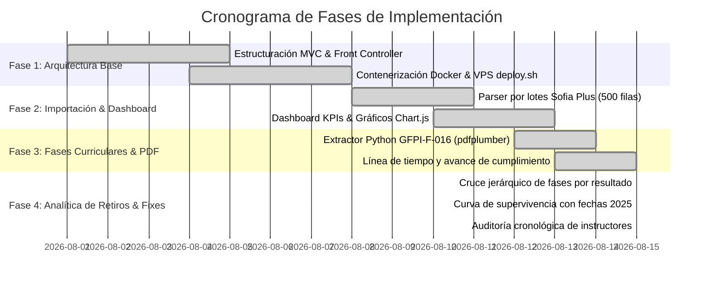

# 📋 Plan de Implementación y Evolución Arquitectónica

Este documento describe las fases estratégicas, el stack tecnológico y los hitos de evolución del **Sistema de Gestión de Datos**.

---

## 🎯 Objetivos Estratégicos

1. **Centralización y Calidad del Dato:** Unificar los reportes heterogéneos de Sofia Plus y los proyectos formativos en una única base de datos relacional consistente.
2. **Monitoreo y Prevención de Deserción:** Proveer herramientas visuales analíticas (curva de supervivencia) para detectar en qué competencias y fechas se concentran las salidas.
3. **Auditoría Transparente:** Visibilizar los tiempos de respuesta y volumen evaluativo de los instructores.
4. **Despliegue Continuo Zero-Downtime:** Automatizar la infraestructura con Docker y scripts de despliegue en VPS.

---

## 🗓️ Fases de Desarrollo del Proyecto

---

## 🛠️ Stack Tecnológico

| Capa | Tecnología | Justificación / Rol |
| :--- | :--- | :--- |
| **Backend** | PHP 8.2+ | Rendimiento, tipado estricto y arquitectura MVC limpia. |
| **Base de Datos** | MariaDB 10.11 / MySQL | Persistencia relacional segura con sentencias preparadas PDO. |
| **Procesamiento PDF** | Python 3.11 + pdfplumber | Extracción precisa de tablas y cajas curriculares del formato GFPI-F-016. |
| **Frontend** | Vanilla CSS Modular + JS | Rendimiento óptimo, sin sobrecarga de frameworks externos. |
| **Gráficos** | Chart.js 4.x | Renderizado responsivo para curvas de supervivencia y barras. |
| **Infraestructura** | Docker + Docker Compose + Nginx | Portabilidad idéntica entre desarrollo local y servidor VPS en producción. |
