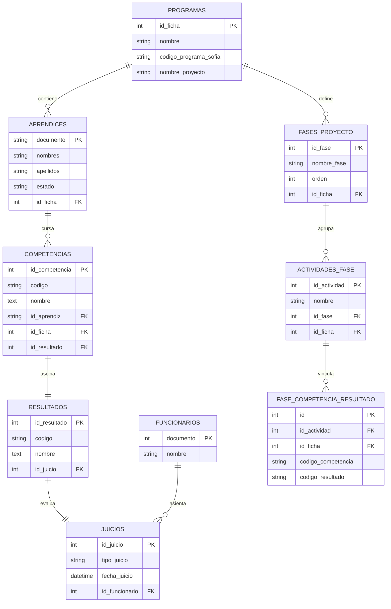

# 📖 Documentación Técnica del Sistema de Gestión de Datos

Esta guía técnica proporciona una visión profunda de los componentes internos, patrones de implementación, modelos de base de datos y endpoints del **Sistema de Gestión de Datos**.

---

## 🏛️ 1. Estructura de Directorios

```
sistema_gestion_datos/
├── app/
│   ├── controllers/
│   │   ├── AprendicesController.php   ← Búsqueda, seguimiento y eliminación
│   │   ├── CargaController.php        ← Importador por lotes de Sofia Plus (Excel/CSV)
│   │   ├── DashboardController.php    ← Endpoints AJAX de KPIs, curva y auditoría
│   │   └── FasesController.php        ← Gestión de fases, actividades y carga de PDF
│   ├── models/
│   │   ├── AprendizModel.php          ← Acceso a datos de aprendices y estados
│   │   ├── BaseModel.php              ← Conexión base PDO y utilidades
│   │   ├── DashboardFasesRepository.php ← Cumplimiento y métricas por fase formativa
│   │   ├── DashboardModel.php         ← KPIs y métricas agregadas del dashboard
│   │   ├── FasesModel.php             ← CRUD y persistencia de proyectos curriculares
│   │   ├── JuiciosModel.php           ← Auditoría y comparativas evaluativas
│   │   ├── ProgramaModel.php          ← Consulta de programas y fichas
│   │   └── RetiradosModel.php         ← Curva de supervivencia y retiros por competencia
│   ├── services/
│   │   └── import/
│   │       ├── CsvAdapter.php         ← Adaptador de lectura de archivos CSV
│   │       ├── ExcelAdapter.php       ← Adaptador de lectura de hojas de cálculo
│   │       ├── FasesImportService.php ← Servicio de procesamiento e inserción de PDF
│   │       └── ImportAdapterInterface.php ← Contrato estándar de adaptadores de importación
│   └── views/
│       ├── aprendices/                ← Vistas de seguimiento y consulta individual
│       ├── carga/                     ← Vista de carga masiva de Sofia Plus
│       ├── dashboard/                 ← Vista principal con gráficos Chart.js y tablas
│       ├── eliminacion/               ← Vista de gestión y borrado de aprendices
│       ├── fases/                     ← Tablero y gestión de proyectos formativos
│       └── layouts/                   ← Cabecera y pie de página compartidos
├── assets/
│   ├── css/                           ← Hoja de estilos centralizada y modular
│   └── js/                            ← Scripts de interacción frontend (fases.js, etc.)
├── config/
│   ├── database.php                   ← Configuración de conexión PDO (sena_juicios)
│   ├── seguridad.php                  ← Rate limiting y cabeceras de protección HTTP
│   └── url_config.php                 ← Enrutamiento y constantes de URLs base
├── controllers/scripts/
│   └── extract_pdf.py                 ← Parser en Python (pdfplumber) para formato GFPI-F-016
├── docs/                              ← Documentación técnica, manuales y arquitectura
├── docker-compose.yml                 ← Definición de contenedores para producción
├── Dockerfile                         ← Construcción de imagen PHP 8.2-FPM + Python
├── deploy.sh                          ← Script automatizado de despliegue en VPS
└── index.php                          ← Front Controller centralizado del aplicativo
```

---

## 💾 2. Esquema Relacional de la Base de Datos (`sena_juicios`)



---

## 📡 3. Principales Endpoints y Rutas AJAX

| Módulo | Acción | Método | Descripción |
| :--- | :--- | :--- | :--- |
| `dashboard` | `kpis` | GET | Retorna los totales de activos, aprobados, pendientes y retiros. |
| `dashboard` | `retirados_competencia`| GET | Devuelve la estructura de curva de supervivencia, fechas 2025 y docentes. |
| `dashboard` | `auditoria_funcionarios`| GET | Retorna totales evaluados, primer y último registro real por docente. |
| `dashboard` | `filtro_avanzado` | GET | Consulta paginada multicriterio o descarga de archivo CSV. |
| `fases` | `cumplimiento_fases` | GET | Retorna el avance porcentual de pares (aprendiz × resultado) por fase. |
| `fases` | `upload_pdf` | POST | Recibe el archivo PDF GFPI-F-016 y ejecuta la extracción curricular. |
| `carga` | `upload` | POST | Procesa la importación masiva de Sofia Plus en bloques de 500 filas. |
