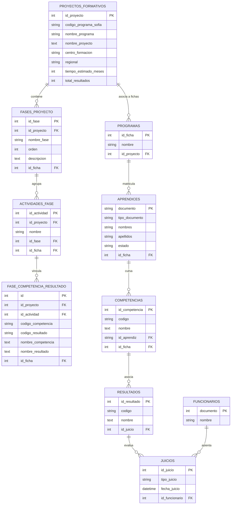

# 📖 Documentación Técnica del Sistema de Gestión de Datos

Esta guía técnica proporciona una visión profunda de los componentes internos, patrones de arquitectura, diccionario exhaustivo de tablas en la base de datos, motor de extracción de PDFs curriculares (formato SENA GFPI-F-016) y catálogo de endpoints del **Sistema de Gestión de Datos**.

---

## 🏛️ 1. Estructura de Directorios del Proyecto

```
sistema_gestion_datos/
├── app/
│   ├── controllers/
│   │   ├── AprendicesController.php   ← Búsqueda, seguimiento individual y eliminación
│   │   ├── CargaController.php        ← Importador por lotes de Sofia Plus (Excel/CSV en bloques)
│   │   ├── DashboardController.php    ← Endpoints AJAX de KPIs, curva de retiro y auditoría
│   │   ├── FasesController.php        ← Gestión de proyectos, fases, actividades y carga PDF
│   │   └── LandingController.php      ← Vista principal y Landing Page Institucional
│   ├── models/
│   │   ├── AprendizModel.php          ← Acceso a datos de aprendices y estados de matrícula
│   │   ├── BaseModel.php              ← Conexión base PDO con transacciones y reconexión
│   │   ├── DashboardFasesRepository.php ← Métricas de cumplimiento formativo por fase
│   │   ├── DashboardModel.php         ← KPIs globales, conteos y auditoría evaluativa
│   │   ├── FasesModel.php             ← Persistencia y consulta de proyectos formativos
│   │   ├── JuiciosModel.php           ← Auditoría y comparativas evaluativas (Aprobado/Por Evaluar)
│   │   ├── ProgramaModel.php          ← Consulta de programas y fichas formativas
│   │   ├── ProyectoModel.php          ← Gestión CRUD de Proyectos Formativos independientes
│   │   └── RetiradosModel.php         ← Análisis de retiros, supervivencia y deserción
│   ├── services/
│   │   └── import/
│   │       ├── CsvAdapter.php         ← Adaptador optimizado para lectura de archivos CSV
│   │       ├── ExcelAdapter.php       ← Adaptador para hojas de cálculo Excel (.xlsx/.xls)
│   │       ├── FasesImportService.php ← Orquestador de validación y persistencia de PDF
│   │       └── ImportAdapterInterface.php ← Contrato estándar de adaptadores de importación
│   ├── views/
│   │   ├── aprendices/                ← Vistas de seguimiento curricular individual por aprendiz
│   │   ├── carga/                     ← Vista de importación masiva de reportes Sofia Plus
│   │   ├── dashboard/                 ← Dashboard interactivo con Chart.js y tablas dinámicas
│   │   ├── eliminacion/               ← Gestión de depuración y borrado seguro de registros
│   │   ├── fases/                     ← Gestión de Proyectos Formativos, vinculación y visor PDF
│   │   ├── landing/                   ← Presentación ejecutiva del sistema y métricas
│   │   └── layouts/                   ← Componentes compartidos (header, footer, nav)
│   └── controllers/scripts/
│       └── extract_pdf.py             ← Motor de extracción inteligente con pdfplumber
├── assets/
│   ├── css/                           ← Estilos modulares (variables CSS, temas y dashboards)
│   └── js/                            ← Controladores frontend (fases.js, pdf_upload.js, etc.)
├── config/
│   ├── database.php                   ← Conexión PDO optimizada a MariaDB/MySQL (`sena_juicios`)
│   ├── seguridad.php                  ← Rate limiting, CORS, CSRF y sanitización de inputs
│   └── url_config.php                 ← Enrutamiento centralizado y resolución de rutas base
├── docs/                              ← Documentación técnica, manuales, requisitos y arquitectura
├── docker-compose.yml                 ← Infraestructura lista para despliegue contenerizado
├── Dockerfile                         ← Imagen Docker PHP 8.2-FPM + Nginx + Python 3.11 + pdfplumber
├── deploy.sh                          ← Script de despliegue automático en servidores VPS
└── index.php                          ← Front Controller centralizado con enrutamiento semántico
```

---

## 💾 2. Esquema Relacional de la Base de Datos (`sena_juicios`)

La base de datos cuenta con una arquitectura desacoplada donde el **Proyecto Formativo** existe de manera independiente y puede ser reutilizado por múltiples fichas o programas de formación:



---

## 📋 3. Diccionario Completo de Tablas

### 1. `proyectos_formativos`
Almacena la cabecera e identificación de cada documento **GFPI-F-016 (Proyecto Formativo)** extraído desde PDF o registrado manualmente.
- `id_proyecto` (INT, PK, AUTO_INCREMENT): Identificador único del proyecto.
- `codigo_programa_sofia` (VARCHAR(20)): Código numérico del programa en SOFIA Plus.
- `nombre_programa` (VARCHAR(255)): Nombre oficial de la carrera o programa formativo.
- `nombre_proyecto` (TEXT): Título completo del proyecto formativo institucional.
- `centro_formacion` (VARCHAR(255)): Centro del SENA responsable del proyecto.
- `regional` (VARCHAR(100)): Regional del SENA a la que pertenece.
- `tiempo_estimado_meses` (INT): Duración estimada de la formación en meses.
- `total_resultados` (INT): Total de resultados de aprendizaje proyectados en el diseño.
- `created_at` / `updated_at` (DATETIME): Marcas de tiempo de auditoría.

### 2. `programas` (Fichas de Formación)
Registra las fichas de caracterización activas en el sistema y su asociación opcional al proyecto curricular.
- `id_ficha` (INT, PK): Número de ficha único asignado en SOFIA Plus.
- `nombre` (VARCHAR(255)): Nombre descriptivo del programa de formación para la ficha.
- `id_proyecto` (INT, FK opcional): Enlace con la tabla `proyectos_formativos`. Permite que múltiples fichas compartan la misma malla curricular.

### 3. `fases_proyecto`
Fases cronológicas y pedagógicas que componen el proyecto formativo.
- `id_fase` (INT, PK, AUTO_INCREMENT): Identificador numérico de la fase.
- `id_proyecto` (INT, FK): Vinculación al proyecto formativo matriz.
- `nombre_fase` (VARCHAR(255)): Nombre canónico de la fase (`ANÁLISIS`, `PLANEACIÓN`, `EJECUCIÓN`, `EVALUACIÓN`).
- `orden` (INT): Posición secuencial en el ciclo de formación (1 a 4).
- `descripcion` (TEXT): Alcance pedagógico de la fase.

### 4. `actividades_fase`
Actividades de proyecto formativo vinculadas a cada fase curricular.
- `id_actividad` (INT, PK, AUTO_INCREMENT): Identificador único de la actividad.
- `id_proyecto` (INT, FK): Enlace al proyecto formativo correspondiente.
- `id_fase` (INT, FK): Fase a la cual pertenece la actividad.
- `nombre` (TEXT): Nombre descriptivo y código interno de la actividad del proyecto.
- `descripcion` (TEXT): Detalle o especificación técnica de la labor formativa.

### 5. `fase_competencia_resultado`
Tabla relacional clave que mapea cada actividad con sus competencias y resultados de aprendizaje específicos (Sección 3 del formato GFPI-F-016).
- `id` (INT, PK, AUTO_INCREMENT): Identificador del registro curricular.
- `id_proyecto` (INT, FK): Proyecto formativo global.
- `id_actividad` (INT, FK): Actividad de proyecto que tributa al resultado.
- `codigo_competencia` (VARCHAR(20)): Código numérico normalizado de la competencia SOFIA Plus.
- `nombre_competencia` (TEXT): Denominación de la norma de competencia laboral.
- `codigo_resultado` (VARCHAR(20)): Código SOFIA o secuencia identificadora del resultado.
- `nombre_resultado` (TEXT): Descripción textual completa del resultado de aprendizaje.

### 6. `aprendices`
Información demográfica y estado formativo de los aprendices registrados en SOFIA Plus.
- `documento` (VARCHAR(255), PK): Documento de identidad del aprendiz.
- `tipo_documento` (VARCHAR(255)): CC, TI, PEP, CE, etc.
- `nombres` y `apellidos` (VARCHAR(255)): Nombres y apellidos del aprendiz.
- `estado` (ENUM): `En formación`, `Retirado`, `Trasladado`, `Egresado`.
- `id_ficha` (INT, FK): Ficha a la que pertenece el aprendiz.

### 7. `competencias`, `resultados` y `juicios`
Tablas operativas alimentadas por la carga masiva del reporte de juicios de SOFIA Plus:
- `competencias`: Almacena el listado de competencias cursadas por cada aprendiz.
- `resultados`: Resultados específicos asociados a dichas competencias.
- `juicios`: Registra el estado de aprobación (`APROBADO`, `POR EVALUAR`, `NO APROBADO`), fecha de evaluación e instructor que emitió el juicio.
- `funcionarios`: Catálogo de instructores evaluadores registrados en las actas de SOFIA Plus.

---

## 🐍 4. Motor de Extracción de PDFs: `extract_pdf.py`

El script ubicado en `app/controllers/scripts/extract_pdf.py` automatiza la interpretación del formato **GFPI-F-016 (Proyecto Formativo SENA)** mediante la librería `pdfplumber`.

### Flujo de Funcionamiento:
1. **Extracción de Metadatos Iniciales (`extract_info_basica`)**:
   - Lee las primeras páginas buscando mediante expresiones regulares el Código de Proyecto SOFIA, Código de Programa, Centro de Formación, Regional, Duración en meses y Cantidad total de resultados de aprendizaje.
2. **Detección Dinámica de Columnas (`detect_col_mapping`)**:
   - Analiza las tablas buscando dinámicamente las columnas de **Fase**, **Actividad de Proyecto**, **Resultado de Aprendizaje** y **Competencia**, adaptándose a variaciones entre regionales del SENA.
3. **Propagación de Celdas Combinadas (`fill_down`)**:
   - Resuelve el problema común de PDFs donde celdas combinadas de fases y actividades solo traen texto en la primera fila, propagando limpiamente los valores hacia las filas secundarias.
4. **Manejo de Continuaciones de Texto Multilínea**:
   - Une textos de nombres largos que se dividen en saltos de fila sin código SOFIA propio, asegurando que la descripción pedagógica no quede mutilada.
5. **Deduplicación Inteligente y Limpieza de Filas Fantasma**:
   - Identifica filas vacías o con solo guiones de relleno (`–`, `—`) y las descarta.
   - Genera una clave única compuesta por `(fase, act_id, res_ident, comp_ident)` normalizando espacios y mayúsculas, garantizando **cero registros duplicados** al importar proyectos de cualquier tamaño.

---

## 📡 5. Catálogo de Endpoints AJAX y Controladores

| Controlador | Acción | Método | Parámetros | Descripción |
| :--- | :--- | :--- | :--- | :--- |
| `DashboardController` | `kpis` | GET | `id_ficha` (opcional) | Retorna contadores agregados de aprendices activos, aprobados y pendientes. |
| `DashboardController` | `retirados_competencia` | GET | `id_ficha` | Curva de supervivencia y competencias con mayor deserción en el año. |
| `DashboardController` | `auditoria_funcionarios` | GET | `id_ficha` | Totales evaluados por cada instructor y fechas de primer/último registro. |
| `DashboardController` | `filtro_avanzado` | GET | Criterios múltiples | Consulta paginada multicriterio con opción de exportación directa a CSV. |
| `FasesController` | `upload_pdf` | POST | Archivo `pdf` | Ejecuta `extract_pdf.py` y retorna la vista previa del proyecto estructurado. |
| `FasesController` | `guardar_pdf` | POST | JSON del proyecto | Persiste el proyecto formativo, sus fases, actividades y resultados en la BD. |
| `FasesController` | `vincular_ficha` | POST | `id_ficha`, `id_proyecto` | Asocia una ficha de formación existente a un proyecto curricular matriz. |
| `FasesController` | `cumplimiento_fases` | GET | `id_ficha` | Porcentaje de avance y cumplimiento de juicios evaluativos por fase. |
| `CargaController` | `upload` | POST | Archivo `file` | Procesa el archivo de Sofia Plus en bloques transaccionales de 500 filas. |

